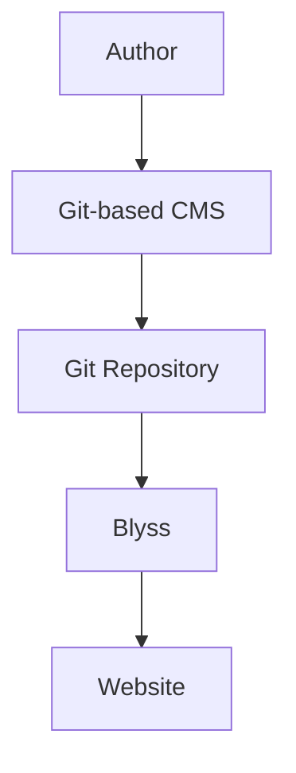

# Blyss 0.4

Blyss is a lean bilingual Markdown transformer and static-site server for Node.js.

Ideal for **local-first & Git-based** build & content workflows!

Optional combination for in-browser content editing:
[Decap CMS](https://decapcms.org/) or
[Tina](https://tina.io/)



## Features

- English and German content trees
- clean localized URLs under `/en/` and `/de/`
- default language redirect from `/` to `/${site.defaultLanguage}/`
- recent-post placeholders via `{{recentPosts}}` that render the newest three posts for the current language
- front matter and localized slugs
- translation matching via `translationKey`
- visible language switchers and `hreflang` alternate links
- Schema.org JSON-LD using a future-proof `@graph`
- static asset copying
- dependency-free Node.js static server

## Commands

```bash
npm {install|ci} && run build
npm start
```

Open `http://localhost:3000` locally.

## Hosting

Set `site.baseUrl`, publisher data, and language details in `blyss.config.js` before production deployment.

## Content

Keep translations linked with the same `translationKey`.

Titles come from front matter, so Markdown body text should begin below the title rather than with another H1.

## Acknowledgments

Blyss was initially developed with assistance from Microsoft 365 Copilot.
All generated code was reviewed and validated by the project maintainer (Blooniverse).
